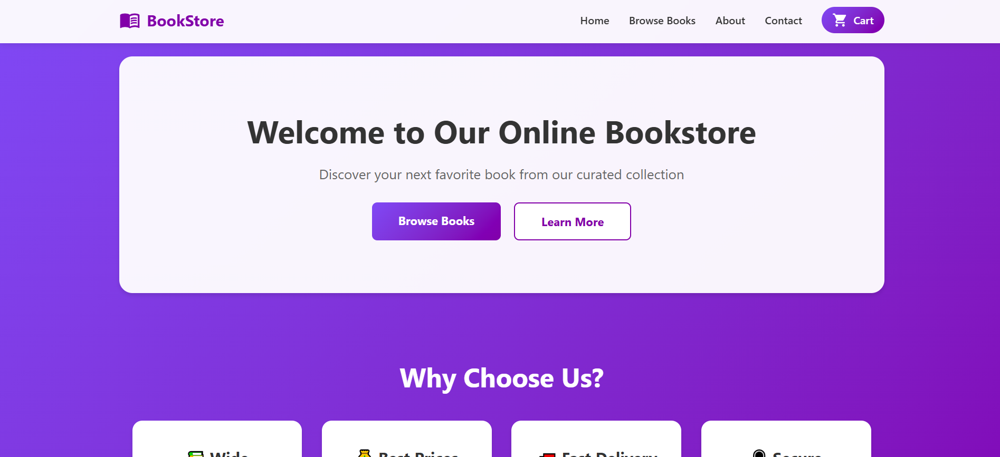

# Online Bookstore

A full-stack online bookstore application built with React frontend and Node.js/Express backend. Browse books, manage your cart, create an account, and place orders with complete user authentication.

## Features

### Frontend Features
- **Browse Books**: View collection of books with titles, authors, genres, and prices
- **Search**: Find books by title or author
- **Shopping Cart**: Add books to cart, adjust quantities, and remove items
- **User Authentication**: Register and login with secure JWT authentication
- **Order Management**: Place orders and view order history
- **Admin Panel**: Admin users can add, edit, and delete books
- **Responsive Design**: Works seamlessly on desktop and mobile devices

### Backend Features
- **RESTful API**: Complete REST API with Express.js
- **MySQL Database**: Relational database for books, users, and orders
- **Secure Authentication**: Password hashing with bcrypt and JWT tokens
- **Role-Based Access Control**: Admin and regular user roles
- **Order Processing**: Complete order management with inventory tracking
- **CORS Enabled**: Cross-origin resource sharing for API access

## Tech Stack

### Frontend
- React 19.1.1
- React Router DOM 7.9.1
- Material-UI Icons 7.3.2
- Axios for API calls
- CSS3 for styling

### Backend
- Node.js with Express.js 4.18.2
- MySQL 2.18.1 for database
- JWT (jsonwebtoken 9.0.2) for authentication
- bcryptjs 2.4.3 for password hashing
- CORS 2.8.5 for cross-origin support

## Setup

### Prerequisites
- Node.js (v14 or higher)
- MySQL Server (v8.0 or higher)
- npm or yarn package manager

### Database Setup

1. **Install MySQL** (if not already installed)
   - Download from [MySQL Official Website](https://dev.mysql.com/downloads/mysql/)

2. **Create Database and Tables**
   ```bash
   # Login to MySQL
   mysql -u root -p
   
   # Run the schema file
   source backend/database/schema.sql
   ```

   Or manually execute the SQL schema from `backend/database/schema.sql`

3. **Configure Database Connection**
   
   Open `backend/server.js` and update the database connection settings:
   ```javascript
   const db = mysql.createConnection({
     host: "localhost",
     user: "root",
     password: "your_password",
     database: "bookstore"
   });
   ```

   Also update the JWT_SECRET in `backend/server.js`:
   ```javascript
   const JWT_SECRET = "your_secret_key_here";
   ```

### Application Setup

1. **Clone the Repository**
   ```bash
   git clone <repository-url>
   cd CSCI426_Project_Phase1
   ```

2. **Install Dependencies**
   ```bash
   # Install frontend dependencies
   npm install
   
   # Install backend dependencies
   cd backend
   npm install
   cd ..
   ```

3. **Start the Backend Server**
   ```bash
   # From project root
   cd backend
   node server.js
   ```
   Backend will run on `http://localhost:5000`

4. **Start the Frontend Application**
   ```bash
   # Open a new terminal, from project root
   npm start
   ```
   Frontend will automatically open at `http://localhost:3000`

## API Documentation

### Authentication Endpoints

- **POST** `/api/auth/register` - Register new user
  ```json
  {
    "username": "string",
    "email": "string",
    "password": "string",
    "full_name": "string",
    "address": "string (optional)",
    "phone": "string (optional)"
  }
  ```

- **POST** `/api/auth/login` - Login user
  ```json
  {
    "email": "string",
    "password": "string"
  }
  ```

- **GET** `/api/auth/profile` - Get user profile (requires auth token)

- **PUT** `/api/auth/profile` - Update user profile (requires auth token)

### Books Endpoints

- **GET** `/api/books` - Get all books
- **GET** `/api/books/:id` - Get single book by ID
- **GET** `/api/books/search/:query` - Search books
- **POST** `/api/books` - Add new book (requires admin auth)
- **PUT** `/api/books/:id` - Update book (requires admin auth)
- **DELETE** `/api/books/:id` - Delete book (requires admin auth)

### Orders Endpoints

- **POST** `/api/orders` - Create new order (requires auth)
  ```json
  {
    "items": [
      {
        "book_id": "number",
        "quantity": "number"
      }
    ],
    "shipping_address": "string"
  }
  ```

- **GET** `/api/orders` - Get user's orders (requires auth)
- **GET** `/api/orders/:id` - Get single order (requires auth)
- **PUT** `/api/orders/:id/status` - Update order status (requires auth)

## Project Screenshots (UI)

### Home Page



## Project Structure

```
CSCI426_Project_Phase1/
├── backend/
│   ├── database/
│   │   └── schema.sql         # Database schema
│   ├── .env.example           # Environment variables template
│   ├── package.json           # Backend dependencies
│   └── server.js              # Express server with API routes
├── src/
│   ├── components/
│   │   ├── Home.js            # Home/Landing page
│   │   ├── BookList.js        # Browse books page
│   │   ├── BookDetails.js     # Dynamic book details page
│   │   ├── About.js           # About page
│   │   ├── Contact.js         # Contact page with form
│   │   ├── Cart.js            # Shopping cart with checkout
│   │   ├── Login.js           # Login page
│   │   ├── Register.js        # Registration page
│   │   ├── Orders.js          # Order history page
│   │   └── Navbar.js          # Navigation bar with auth
│   ├── context/
│   │   └── AuthContext.js     # Authentication context
│   ├── services/
│   │   └── api.js             # API service with axios
│   ├── css/
│   │   ├── Home.css
│   │   ├── BookList.css
│   │   ├── BookDetails.css
│   │   ├── About.css
│   │   ├── Contact.css
│   │   ├── Cart.css
│   │   ├── Auth.css           # Login/Register styling
│   │   ├── Orders.css         # Orders page styling
│   │   ├── Admin.css          # Admin panel styling
│   │   └── Navbar.css
│   ├── App.js                 # Main app with routing
│   ├── App.css
│   ├── index.js               # Entry point
│   └── index.css
├── public/
│   └── index.html
└── package.json               # Frontend dependencies
```

## Admin Panel

The application includes an admin panel for managing the book inventory.

### Admin Access
- Default admin credentials (as set in database schema):
  - **Username**: admin
  - **Email**: admin@bookstore.com  
  - **Password**: admin123 (you'll need to hash this properly when setting up)

### Admin Features
- **Add New Books**: Create new book entries with all details (title, author, genre, price, stock, etc.)
- **Edit Books**: Update existing book information
- **Delete Books**: Remove books from the catalog
- **View All Books**: See complete inventory in table format

### Accessing Admin Panel
1. Login with admin credentials
2. Click "Admin Panel" in the navigation bar (only visible to admin users)
3. Use the interface to manage books

**Note**: The admin panel is protected and only accessible to users with `is_admin = TRUE` in the database.

## How It Works

### User Authentication
- Register with username, email, and password
- Login to access personalized features
- JWT tokens stored in localStorage for session management
- Role-based access control (admin/user)
- Protected routes require authentication

### Shopping Flow
1. Browse books on the main catalog page
2. Search for specific books using the search bar
3. Click on books to view detailed information
4. Add books to cart with one click
5. View cart and adjust quantities
6. Login or register if not authenticated
7. Enter shipping address and place order
8. View order history in "My Orders" section

### Order Management
- Orders are created with pending status
- Each order includes book details, quantities, and total price
- Order history shows all past orders
- Inventory automatically updates when orders are placed

## Technologies Used

- **React 19** - Frontend framework
- **React Router** - Navigation and routing
- **Material-UI Icons** - UI icons
- **Axios** - HTTP client for API calls
- **Express.js** - Backend framework
- **MySQL** - Relational database
- **JWT** - Secure authentication
- **bcryptjs** - Password hashing
- **CSS3** - Styling with gradients and animations

## Database Schema

### Users Table
- `user_id` (Primary Key)
- `username` (Unique)
- `email` (Unique)
- `password` (Hashed)
- `full_name`
- `address`
- `phone`
- `created_at`, `updated_at`

### Books Table
- `book_id` (Primary Key)
- `title`
- `author`
- `genre`
- `description`
- `price`
- `stock_quantity`
- `pages`, `year`
- `image_url`
- `created_at`, `updated_at`

### Orders Table
- `order_id` (Primary Key)
- `user_id` (Foreign Key → users)
- `total_amount`
- `status` (pending/processing/completed/cancelled)
- `shipping_address`
- `created_at`, `updated_at`

### Order Items Table
- `order_item_id` (Primary Key)
- `order_id` (Foreign Key → orders)
- `book_id` (Foreign Key → books)
- `quantity`
- `price`
- `created_at`

## Security Features

- Passwords hashed using bcrypt (10 salt rounds)
- JWT tokens for stateless authentication
- Protected API endpoints requiring authentication
- SQL injection prevention with parameterized queries
- CORS configuration for secure cross-origin requests

## Future Enhancements

- Admin dashboard for managing books and orders
- Payment gateway integration
- Book reviews and ratings
- Wishlist functionality
- Advanced search filters
- Email notifications for order confirmations
- Password reset functionality

